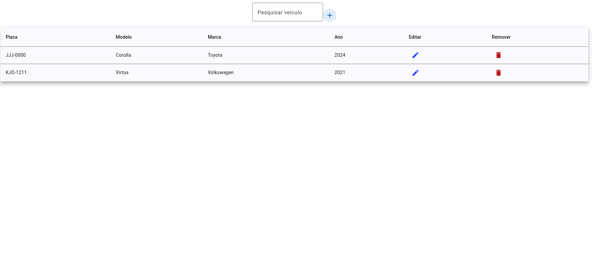
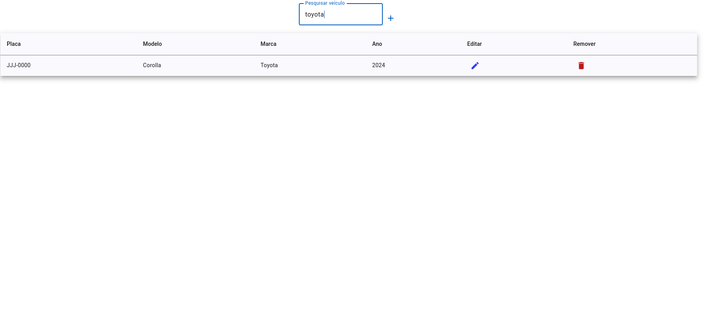
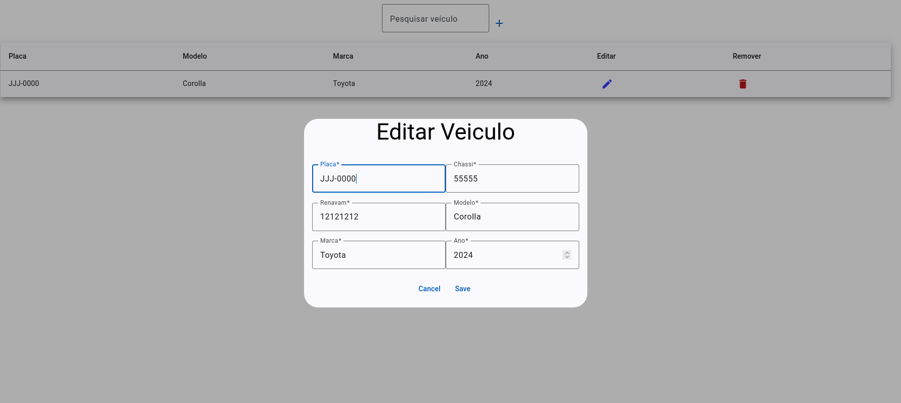

## Descrição da Aplicação

Esta aplicação permite gerenciar informações sobre veículos. Com ela, você pode:

- **Criar** um novo veículo, adicionando informações como placa, chassi, renavam, modelo, marca e ano.
- **Alterar** as informações de um veículo existente.
- **Remover** veículos do sistema quando não forem mais necessários.

Essas funcionalidades facilitam a administração e organização de dados sobre veículos de forma simples e eficiente.

## Instruções para Iniciar o Projeto

Abaixo estão os comandos principais para rodar o projeto e o que cada um faz:

### 1. `npm start`
Este comando inicia o servidor do Node.js, que é a parte backend do projeto. Ele é responsável por lidar com requisições, banco de dados e a lógica de negócios. Ao rodar `npm start`, o servidor backend ficará ativo e pronto para atender às requisições que o frontend (interface do usuário) fizer.

### 2. `npm run test`
Este comando executa os testes automatizados do projeto. Ele verifica se as principais funcionalidades do backend estão funcionando corretamente. Cada teste simula uma ação ou requisição, garantindo que o sistema responde como esperado. Os testes ajudam a identificar possíveis problemas antes de liberar o projeto.

### 3. `ng serve`
Este comando inicia o servidor do Angular, que é a parte frontend do projeto. O frontend é a interface que o usuário vê e com a qual interage. Ao rodar `ng serve`, o Angular compila o código do frontend e o disponibiliza em um servidor local, normalmente acessível em `http://localhost:4200`, onde você pode ver e testar a interface.

---

Esses três comandos são utilizados para rodar as partes principais do projeto: o backend (`npm start`), os testes (`npm run test`), e o frontend (`ng serve`).
